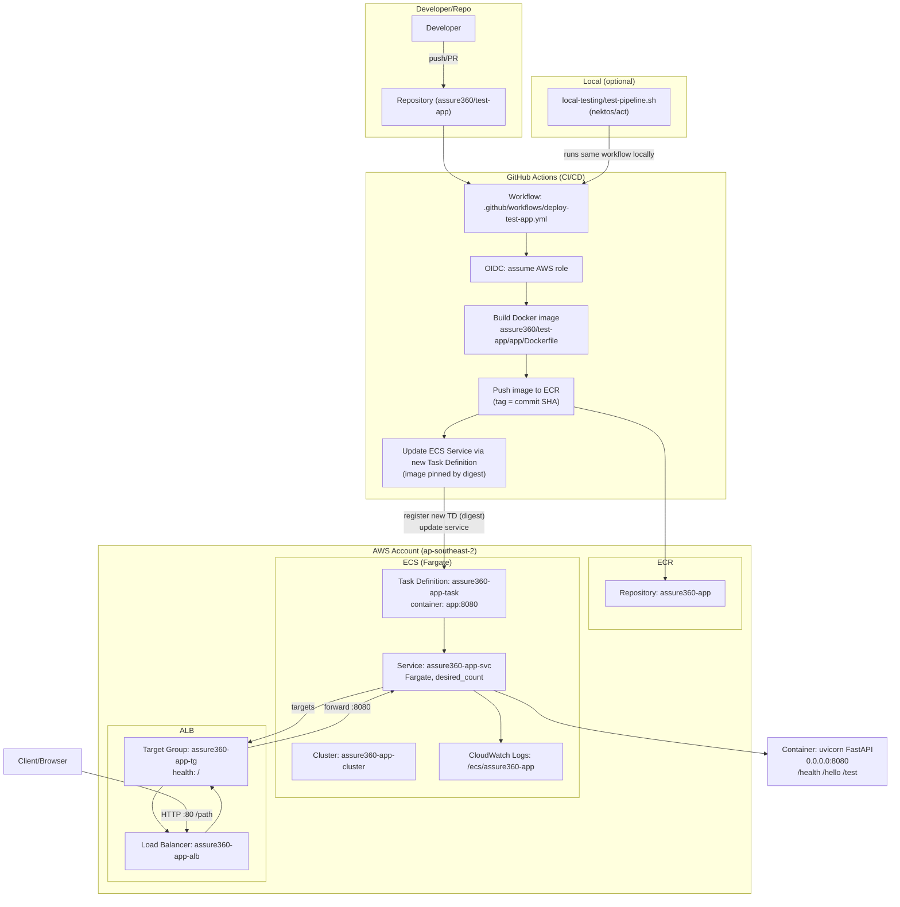

# Assure360 Test App - ECS/Fargate Architecture

This document summarizes what is built for the test app, how components connect, and where to find them in the repo and AWS.

## Topology (vertical)

## What is built (AWS)

- ECR
  - Repository: `assure360-app`
  - Stores app container images; workflow tags each build with the commit SHA and deploys by image digest
- ECS (Fargate)
  - Cluster: `assure360-app-cluster`
  - Task Definition: `assure360-app-task`
    - Container: `app`
    - Port: `8080/tcp`
    - Logs: CloudWatch Logs group `/ecs/assure360-app`
  - Service: `assure360-app-svc`
    - Launch type: Fargate
    - Desired count: managed by Terraform (`assure360/networking`)
- ALB
  - Load Balancer: `assure360-app-alb`
  - Target Group: `assure360-app-tg`
    - Health check path: `/`
  - Listener: HTTP :80 -> forwards to target group
- Networking and security
  - VPC with public subnets A/B
  - Security groups for ALB and ECS tasks
- IAM
  - ECS task execution role with `AmazonECSTaskExecutionRolePolicy`

## What is in the repo

- App container
  - `assure360/test-app/app/Dockerfile`: Python 3.11 slim, runs `uvicorn app:app` on 0.0.0.0:8080, non-root user, healthcheck -> `/health`
  - `assure360/test-app/app/app.py`: FastAPI app exposing `/`, `/health`, `/hello`, `/test`
  - `assure360/test-app/app/requirements.txt`: `fastapi`, `uvicorn[standard]`
- CI/CD workflow
  - `.github/workflows/deploy-test-app.yml`
    - Builds image, pushes to ECR with tag = commit SHA
    - Resolves image digest, registers new task definition revision, updates ECS service, waits healthy via ALB, curls endpoints
- Local testing
  - `assure360/test-app/local-testing/test-pipeline.sh`
    - Refreshes AWS SSO creds and writes `.secrets`
    - Runs the same GitHub Actions workflow locally via `act`
- Terraform (ECS/ALB stack)
  - `assure360/networking/*` provisions VPC, ALB, ECS Cluster/Service/Task, ECR

## How deploy works (digest-based)

1. Build container and push to ECR with tag = commit SHA
2. Resolve that tag's imageDigest
3. Register a new ECS Task Definition revision updating container `app` to `ECR_REPOSITORY@sha256:<digest>`
4. Update the ECS Service to the new Task Definition (force new deployment)
5. Wait for ALB target health; then curl `/health`, `/hello`, `/test`

## Endpoints

- Health: `GET /health`
- Hello: `GET /hello`
- Test: `GET /test`

## Notes

- The container runs as a non-root user (UID 10001)
- Logging is stdout/stderr to CloudWatch via awslogs driver
- ALB health checks `/`; container healthcheck probes `/health`
